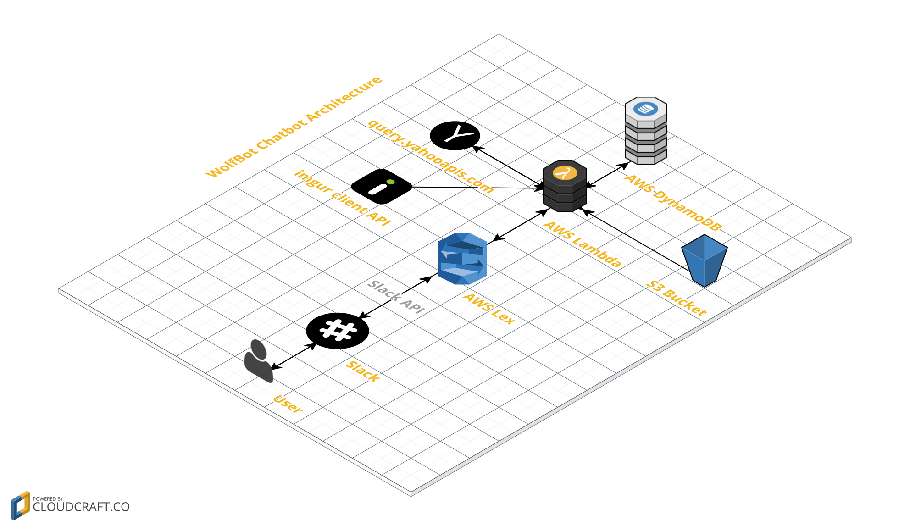

# WolfBot, your stock market companion

WolfBot is your personal stock market companion on Slack! It can fetch your stock information, provide trending data and keep an eye on your watchlist. All done via Natural Language Processing (provided by AWS Lex).

# Add to your Slack channels

## Demo

[Youtube Demo Video](https://youtu.be/qLd8xrJMaSc)

Note: This is my submission for [AWS Chatbot Challenge](https://aws.amazon.com/blogs/aws/announcing-the-aws-chatbot-challenge-create-conversational-intelligent-chatbots-using-amazon-lex-and-aws-lambda/)

## Current Features:

## Spotcheck
WolfBot can fetch stock information for you when you enter the stock symbol.

## Historical Trend
WolfBot will able to show you historical data and plot it as a trend graph.

It can even take precise dates.

## Watchlist

Wolfbot can even help you keep track of your portfolio by sniffing out your watchlist.

You can add a symbol to the list

Or delete one.

And display your watchlist!

## Help
If you ever get stuck, just type in "Help Me" for random tips!

## Deployment Instructions
[Click here](./Deployment.md)

## Dev Stack

1.	Python 3.6
2.	Slack API
3.	query.yahooapis.com

## AWS Services Used
1.	AWS Lex
2.	AWS Lambda
3.	AWS DynamoDB
4.	S3 Bucket

## Architecture

